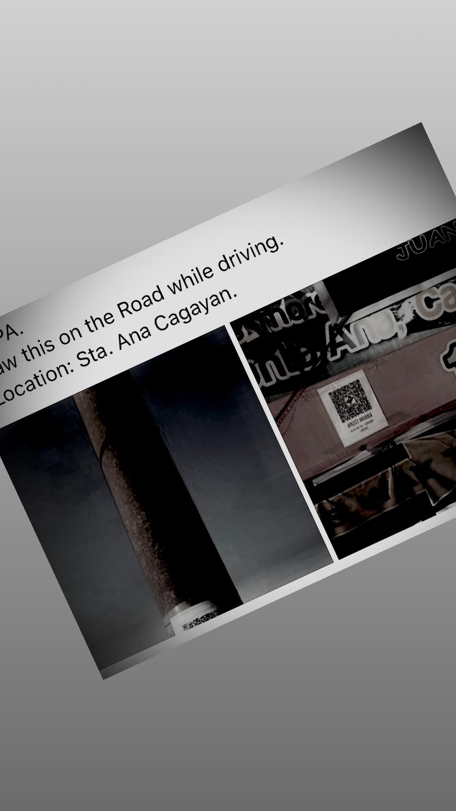
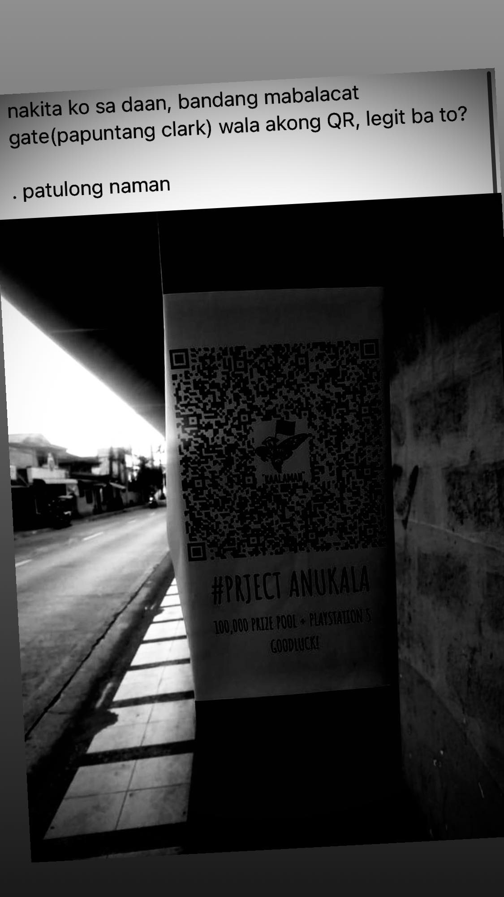
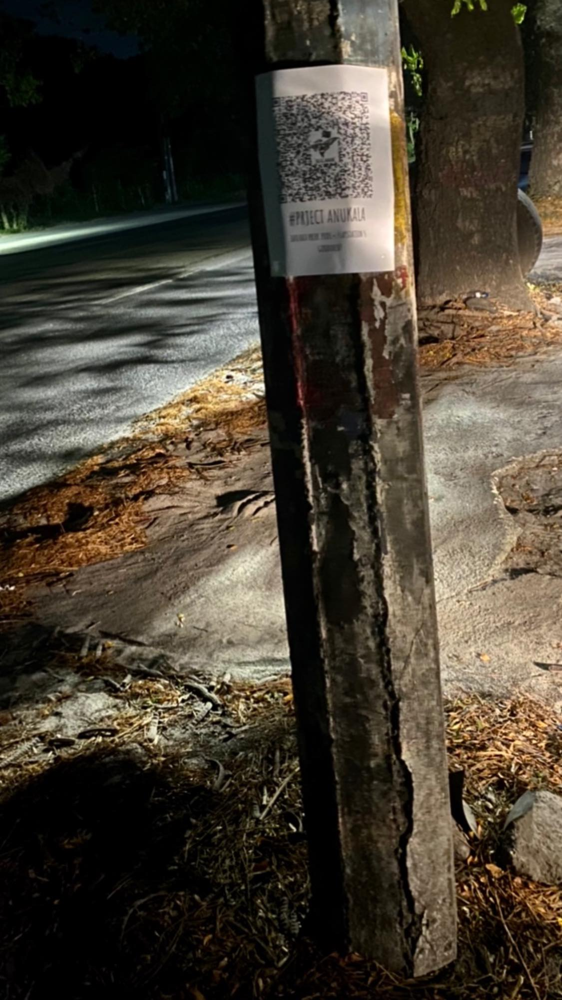
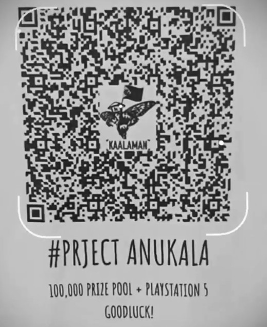

- [Filipino Version](#filipino)

---

# Background

I woke up this morning to hundreds of messages sent to my [contact
form](/about#contact), many in a language Google Translate identifies as
Filipino. The only common thread among the messages were the words "arg" (in
various forms of capitalization) and the word "Kaalaman." 

One of the messages was from a very helpful person who explained the situation:

> Hi so uh do you know who's Kaalaman? Or are you related to him? Uhm He's a
> Filipino Youtuber who upload videos like dyk?, Facts, and stuff. But the
> thing is he's holding an Arg game on the Philippines and I saw this link on
> his my day/story on fb so i check it out then it lead me to this. If you're
> not related to him just don't mind this message hehe.
>
> If you're interested to know him or what so ever here's the link to his Yt
> channel (◕દ◕) <https://youtube.com/channel/UCTfv9FQ_wKXIjzCIHxnSn2A>
>
> His FB page
> <https://www.facebook.com/2269921299925976/posts/2828470187404415/>
>
> Again he's holding an Arg game so that is not just his yt channel. 

An ARG is an Alternate Reality Game, which in this case is similar to a
scavenger hunt with clues that come out over
time.^[<https://en.wikipedia.org/wiki/Alternate_reality_game>] Kaalaman has 2.3
million subscribers on YouTube and 3.5 million followers on Facebook, which
explains why I received so many
messages.^[<https://www.facebook.com/KaalamanHQ/>] And he did, indeed post a
story featuring a QR code with a link to my website.^[The story is here (if it
is still up). Note that this requires a Facebook login:
<https://www.facebook.com/stories/2521822524735851>] This seems to be part of
the ARG he is running called "Project Anukala" that looks to have a pretty
large prize pool. 

A person on Facebook explains how he solved some of
it.^[<https://www.facebook.com/photo.php?fbid=467524521059502&set=a.110447280100563&type=3>]

# The Challenge

I am not connected to Kaalaman, and did not know about him until today. However his next challenge for the ARG uses a tool I created called [Link Lock](https://jstrieb.github.io/link-lock/).

This tool lets anyone add a password to a link. Link Lock is built so that I cannot see the password, and I cannot even see when someone adds a password to a link! It is secure against everyone, including me. Unfortunately, this means that I cannot help solve the next part of the challenge. The only way forward is to figure out the password for the link.

Here are the photos and videos that I saw in Kaalaman's Facebook story:

Click to view photos and videos

 

<video controls>
<source src="kaalaman_story_3.mp4" type="video/mp4" />
</video>

<video controls>
<source src="kaalaman_story_5.mp4" type="video/mp4" />
</video>

From these I was able to extract an image of the QR code.

This points to this link protected with a password:

<https://jstrieb.github.io/link-lock/#eyJ2IjoiMC4wLjEiLCJlIjoiM1Q3VTB0dDF4eUhBOUNCU00yeXc5UDI0aURRWHZoQUp1K25BblFGT3VrWFlDUDlVeXcwR1RWdlQwYTJ5bFE9PSIsImgiOiIwMy8wNC8yMSAtIEZhY2Vib29rIEBLYWFsYW1hbiIsImkiOiJRQlFBRHZuMDZKdW9hQmdUIn0=>

That link has a hint:

> Hint: 03/04/21 - Facebook @Kaalaman

That is all I know about this challenge. Good luck!

---

# Filipino

**Isinalin ito mula sa English gamit ang Google Translate. Humihingi ako ng
paumanhin kung ito ay masama.**

Hindi ko alam ang tungkol sa Kaalaman. Ngunit ang susunod na tanong para sa ARG
ay gumagamit ng isang computer software na aking nilikha na tinawag na [Link
Lock](https://jstrieb.github.io/link-lock/).

Hinahayaan ng software na ito ang sinuman na magdagdag ng isang password sa
isang link. Ang Link Lock ay binuo upang hindi ko makita ang password, at hindi
ko makita kung may nagdagdag ng isang password sa isang link! Ito ay ligtas
laban sa lahat, kasama na ako. Sa kasamaang palad, nangangahulugan ito na hindi
ako makakatulong malutas ang susunod na bahagi ng hamon. Ang tanging paraan
lamang ay upang malaman ang password para sa link.

Narito ang QR code na nakita ko sa kwento sa Facebook ni Kaalaman:

Itinuturo nito ang link na ito na protektado ng isang password:

<https://jstrieb.github.io/link-lock/#eyJ2IjoiMC4wLjEiLCJlIjoiM1Q3VTB0dDF4eUhBOUNCU00yeXc5UDI0aURRWHZoQUp1K25BblFGT3VrWFlDUDlVeXcwR1RWdlQwYTJ5bFE9PSIsImgiOiIwMy8wNC8yMSAtIEZhY2Vib29rIEBLYWFsYW1hbiIsImkiOiJRQlFBRHZuMDZKdW9hQmdUIn0=>

> Hint: 03/04/21 - Facebook @Kaalaman

Suwerte ang paglutas ng hamon!
